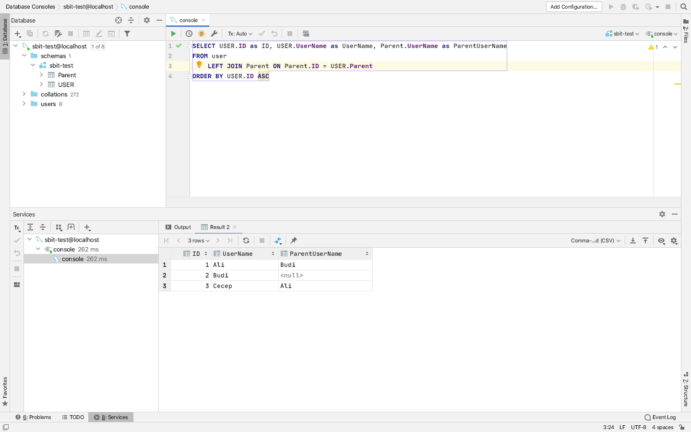
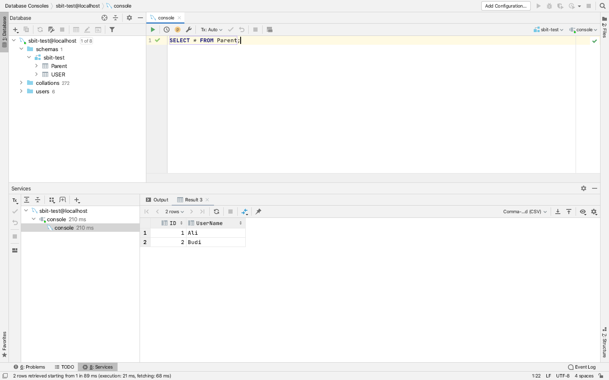
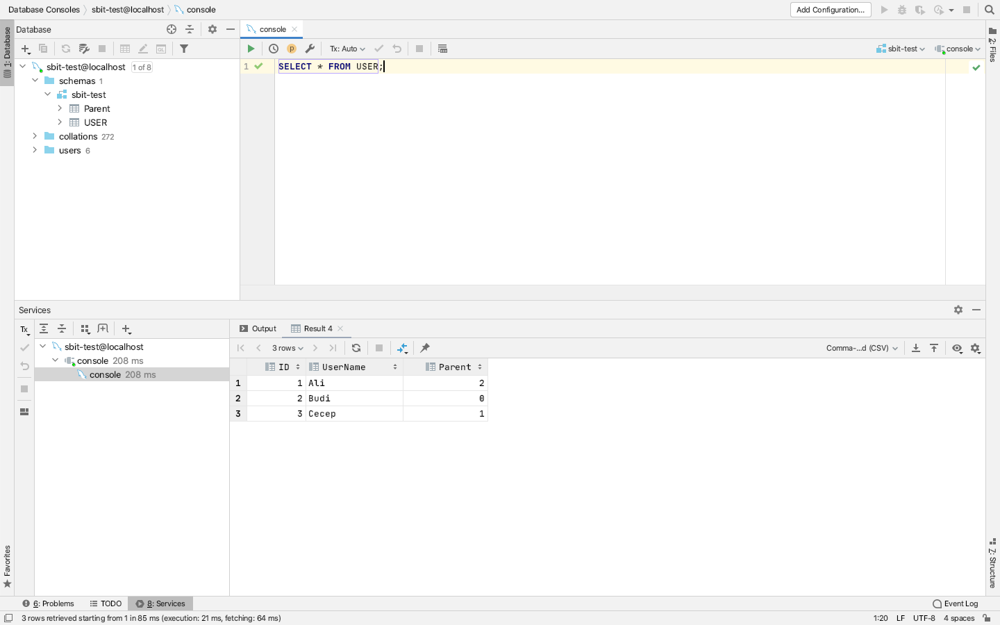

- Export database from `1_query/sbit-test.sql` @ mysql
`SELECT USER.ID as ID, USER.UserName as UserName, Parent.UserName as ParentUserName FROM user LEFT JOIN Parent ON Parent.ID = USER.Parent ORDER BY USER.ID ASC`

live demo: [https://sbit-test.herokuapp.com/](https://sbit-test.herokuapp.com/)