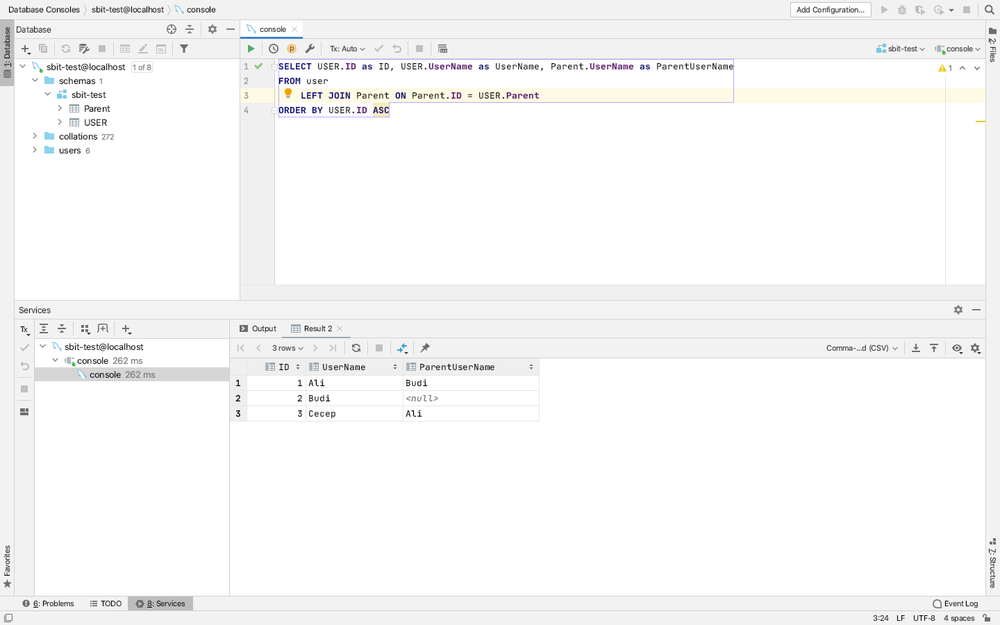
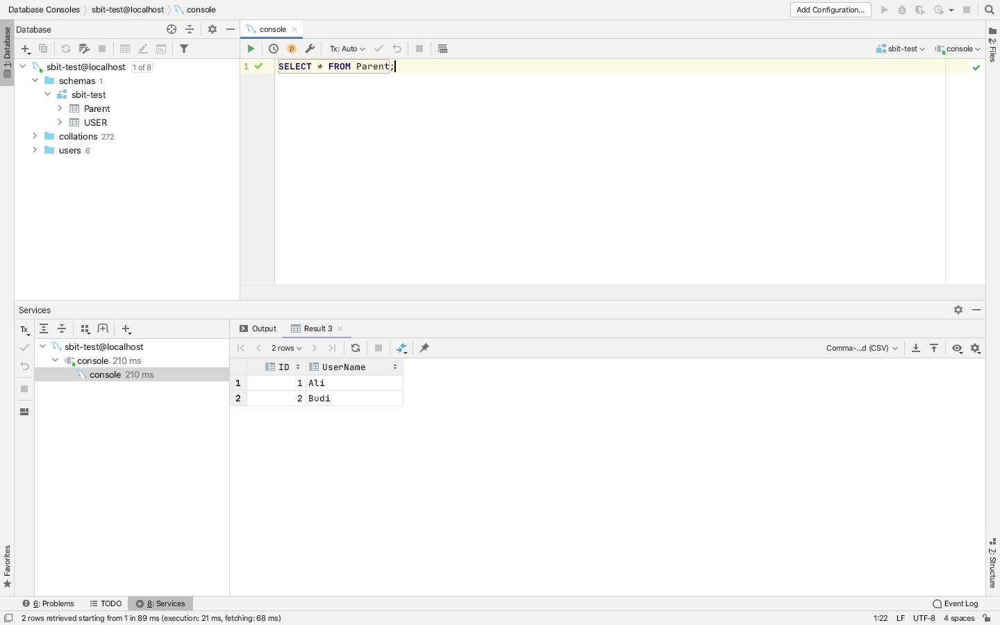
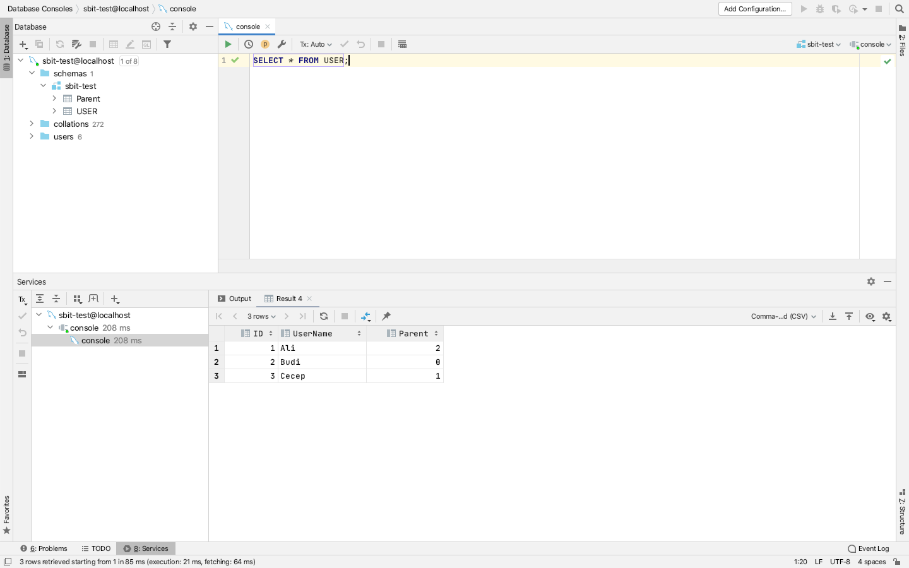

- How to running solution of number 1
Export database from `1_query/sbit-test.sql` @ mysql
`SELECT USER.ID as ID, USER.UserName as UserName, Parent.UserName as ParentUserName FROM user LEFT JOIN Parent ON Parent.ID = USER.Parent ORDER BY USER.ID ASC`

- How to running of number 2
`cd 2_express`
for development and `yarn dev` or `npm run dev`
for build soruce `yarn build` or `npm run build`
for running production `yarn start` or `npm run start`
- How to running solution of number 3
`yarn 3` or `npm run 3`
- How to running solution of number 4
`yarn 4` or `npm run 4`